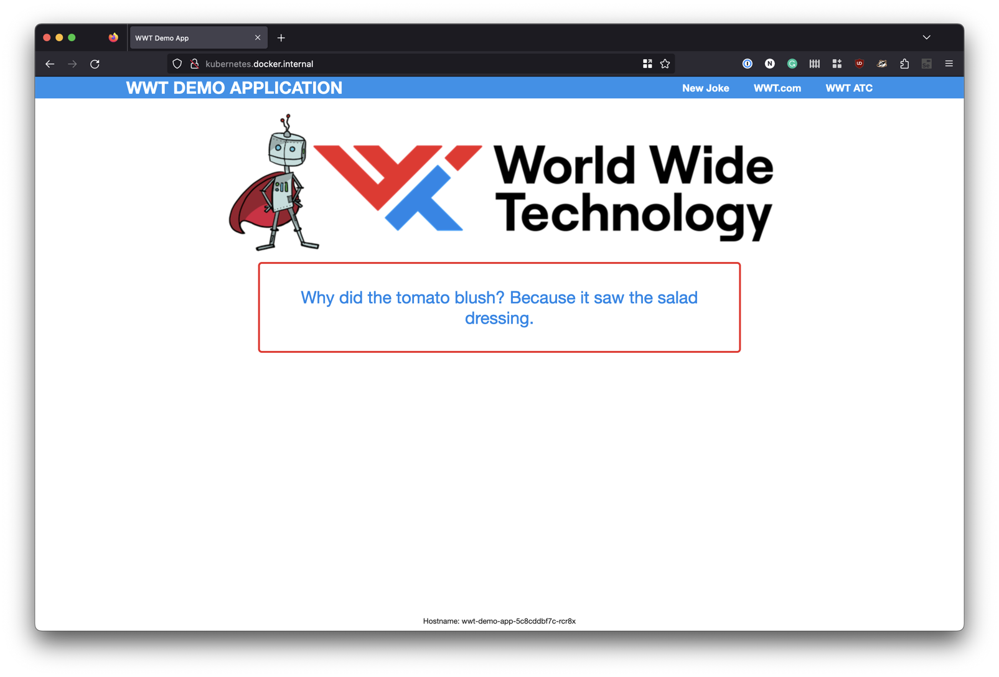
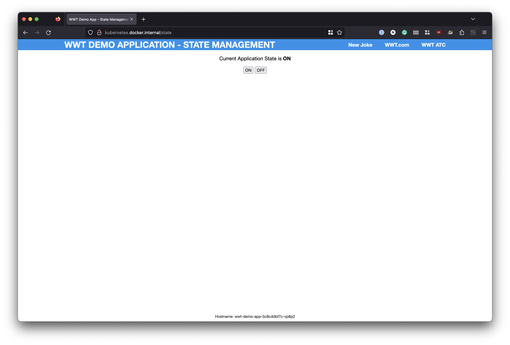
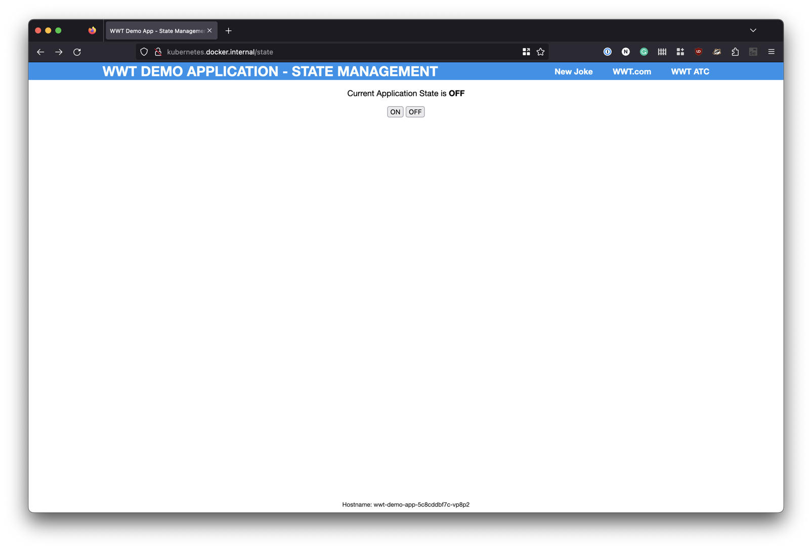
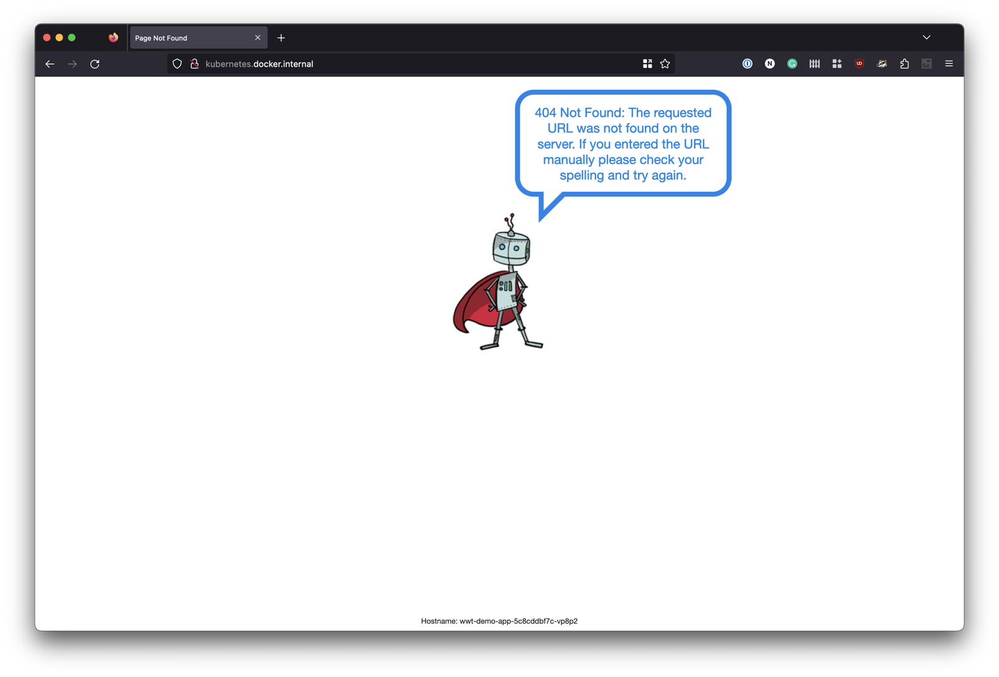

# WWT Demo Web Application

Python and Flask based application to render a web page with a dad joke.

Header name and colors are customizable via environment variables or command line switches.

| variable | accepted values |
| --- | --- |
| HEADER_COLOR | Choice of ["red", "blue", "darkblue", "pink"] |
| HEADER_TITLE | Any provided string |

This application also includes state management at the `/state` URL when the application is running.  When you set the state to `OFF`, the application will then issue 404 errors when you attempt to access the main URL.  This capability has been added to support testing/monitoring of the application and simulating failures.

## Screen Shots






## CLI Usage

```shell
python app.py --title="Your Title" --color="blue"
```

## Application Container

This application is available packaged and ready for use as a container and is published at `quay.io/nsthompson/wwt-demo-app`.

### Pulling the Container

#### Podman

```shell
podman pull quay.io/nsthompson/wwt-demo-app
```

#### Docker

```shell
docker pull quay.io/nsthompson/wwt-demo-app
```

### Kubernetes or Openshift Deployment

This application is also packaged and available for deployment on kubernetes or Red Hat Openshift using helm.  The helm chart can be found in `helm/wwt-demo`.

When using helm, you will need to modify `helm/wwt-demo/values.yaml` to fit your environment.  The primary key/values that need to be addressed are:

`deploymentTarget` - Set this to `kubernetes` or `openshift`

When using kubernetes, you will also need to adjust the configuration located under `deploymentIngress`.  This has currently been tested on native kubernetes running with Docker Desktop and NGINX ingress controller on MacOS.

When using Red Hat Openshift, you will need to adjust the configuration located under `openshiftCluster`.  This is where you will specify the `ingressDomain` used for the Openshift route that will be deployed so you can access the application.

## Contributors

Nick Thompson (<https://github.com/nsthompson>)
